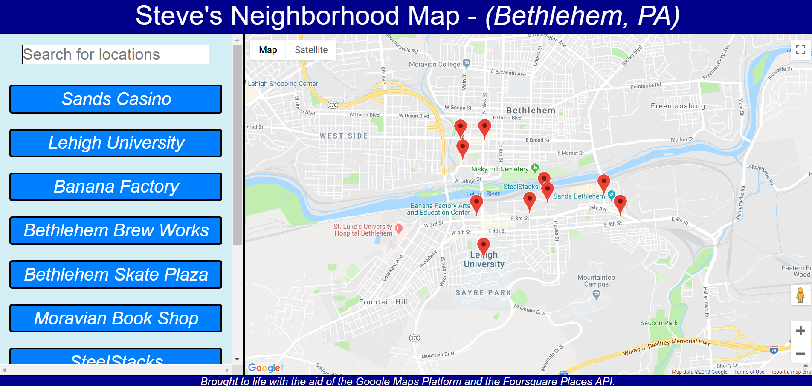

# Neighborhood Map App - (Bethlehem, PA)

This project is a simple single-page application that displays a map and useful information about a list of interesting local landmarks in Bethlehem, PA (my hometown). Users can query for a particular location to narrow the selections, and click on a map marker to discover photos, ratings, and likes. The application uses the React library to display the page's UI and gathers map/location information by fetching data from the Google Maps and Foursquare Places APIs. 

At this point in development, there is a static list of 10 popular Bethlehem locations included within the application. For now, I have hard-coded these locations into the App component to reduce API requests, but this may eventually change as I make further updates.

The application is also responsive and restructures its layout for a better user experience on tablet / mobile screens.

## Table of Contents

* [Instructions](#instructions)
* [Included APIs](#included-apis)
* [Other Contributors](#other-contributors)
* [Contributing](#contributing)
* [Licenses](#licenses)

## Instructions

In order to run the development version of this application, you'll first need to download the below files or clone this repository to get started. The app is built using the React library, so you'll also need to run `npm install` on your terminal while in the project directory to install all project dependencies. Finally, you'll need to run `npm start` in the project directory in order to start the development server.

Note I have not yet moved this app into production as I wish to make further edits to it beyond the scope of this course's requirements.

The project repository includes the following file structure:

	|-- .gitignore
	|-- app-screenshot.PNG
	|-- CONTRIBUTING.md  
	|-- package-lock.json
	|-- package.json
	|-- README.md
	|-- public (Blank HTML to anchor page, development service worker, page icon)
	|   |-- favicon.ico
	|   |-- index.html
	|   |-- manifest.json
	|   |-- service_worker.js
	|-- src (Core application framework)
	   |-- App.js
	   |-- App.test.js
	   |-- index.js
	   |-- logo.svg
	   |-- registerServiceWorker.js
	   |-- components (React components used to render the UI of the application)
	   |   |-- Footer.js
	   |   |-- ListView.js
	   |   |-- Map.js
	   |   |-- Title.js
	   |-- css (CSS to style the app, including responsive media queries)
	       |-- App.css
	       |-- Footer.css
	       |-- index.css
	       |-- ListView.css
	       |-- Map.css
	       |-- Title.css

Users should download the entire file directory, although content outside of sub-folders (for exampmle, this README) can be safely ignored if desired.

## Included APIs

The application fetches data from the Google Maps API in order to display a map and markers and from the Foursquare Places API in order to display location-specific data, which means internet access is required for all functionality to work correctly (at least initially, until the page's service worker can cache returned results). Access to these APIs is required for the project to run correctly, but no additional installation or changes need to be made to the code in order to begin using them.

Please note that currently my Google Maps API key, Foursquare client ID, and Foursquare client secret are all being used to power and validate the remote data calls within this project. While this is the intent of the project for development and evaluation by the Udacity reviewers, due to quota limits it is not necessarily optimized for production. Please either be responsible with use of my credentials or replace them with your own.

## Other Contributors

This project was bootstrapped with [Create React App](https://github.com/facebookincubator/create-react-app). You can find more information on how to perform common tasks [here](https://github.com/facebookincubator/create-react-app/blob/master/packages/react-scripts/template/README.md).

While I am the primary content creator of this project and was responsible for developing the contents of this repository beyond an initial [Create React App](https://github.com/facebookincubator/create-react-app) build, there are several locations within my JS where I credit code ideas or methodology to other sources (e.g. StackOverflow).

## Contributing

Since this project is being used as an evaluation for the Udacity FEND, at this time I am **NOT** accepting pull requests. This may change as the project and nanodegree course are completed and I look to optimize the project further, so stay tuned!

For details, check out [CONTRIBUTING.md](CONTRIBUTING.md).

## Licenses

This project is freely available for you to use however you want. If you are a fellow Udacity FEND student, feel free to look at this project for guidance but please do not utilize any of my code in a way that violates Udacity's Honor Code / plagiarism guidelines.